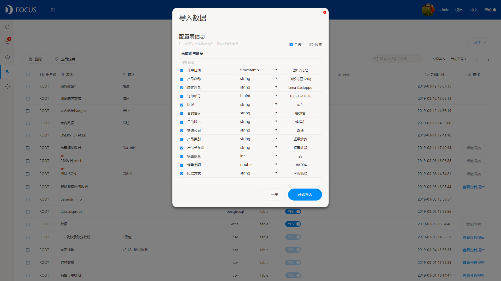
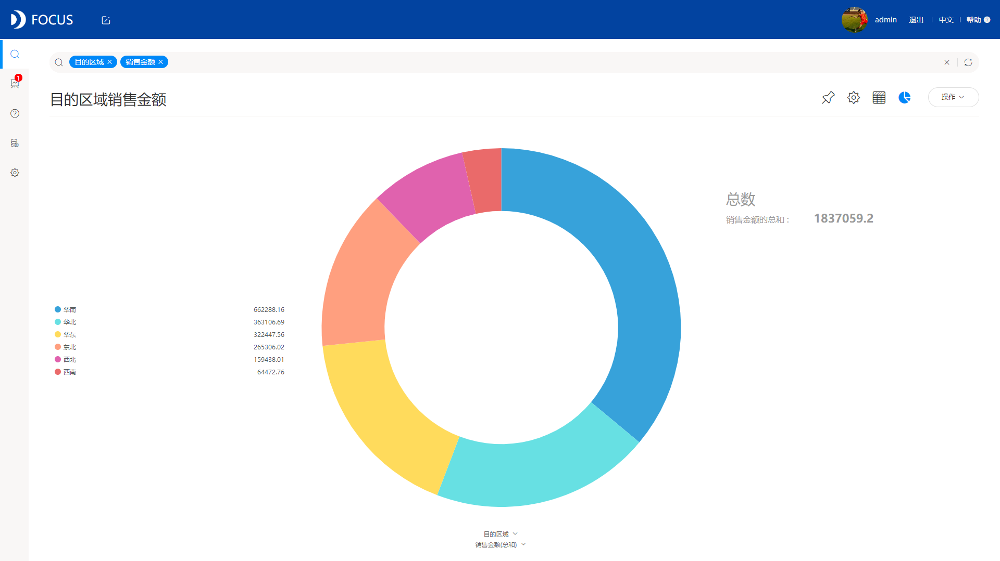

今天给大家推荐一些简单的，日常工作中很实用的，性价比高的可视化工具，希望大家能真正用好可视化工具。

一款好的可视化工具需要具备什么条件呢？从我个人的使用感受来说，首先必须要操作简单，操作太复杂的学习成本也太高，费时间，还会让人产生厌烦心理，最好是那种“傻瓜式”的，尽量没有代码的；其次性价比要高，不要盲目追求贵的就是好的，要找到性价比合适的；最后可视化工具，展示的图形好不好看也是很重要的。

好吧，那下面就分享一款我觉得挺符合上面三个条件的可视化工具——DataFocus。DataFocus是一款集数据仓库、数据分析、报表系统、数据可视化于一身的工具。我们今天主要介绍其数据可视化这部分功能。

第一次接触到DataFocus的时候，就被它极其简单的操作给惊艳了。它不需要你知道IT知识，也不需要写任何的代码或者SQL语句，更不需要花大量时间学习，我敢保证你学习十分钟就可以很快上手，几分钟就可以做出一个好看的可视化大屏。

DataFocus图表类型多样，包含有基础图形和高级图形，基础图形有柱状图、折线图、饼图、雷达图、气泡图、位置图等，高级图形有桑基图、平行图、时序图、树形图、旭日图等。实现方式新颖简单，不同于传统的拖拽，DataFocus采用更先进的搜索式，没错，就像谷歌搜索一样，且系统会智能适配图表，什么样的数据适合什么样的图表，系统会告诉你。

下面这些都是我用DataFocus制作的可视化图表和大屏，我做完这些，只花了几分钟而已：

简单实用，性价比高，可视化效果好，这些都是DataFocus的优点，也正是因为这些优点，才让我变成DataFocus的忠实使用者！
