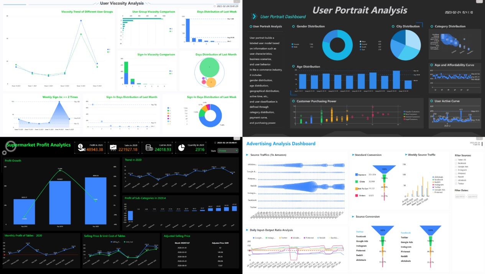

在这个数据化运营的时代，无论大小，每一家企业都需要处理、分析、呈现大量数据。然而，对于中小型企业来说，拥有自己的数据科学团队并不现实，而选购大型的商业智能（BI）工具又可能超出预算。那么，有没有一款工具既能满足中小企业在数据处理上的需求，又不会造成经济负担呢？答案是有的——那就是Datafocus Cloud。

## 1.引言

对于中小型企业来说，他们需要的BI工具通常有以下特点：简单易用、功能实用、部署便捷、支持移动设备并且价格适中。Datafocus Cloud正是在了解了这些需求后，精心设计出来的产品，致力于帮助中小企业从大量数据中获取到有价值的信息。

## 2.简单易用

首先，Datafocus Cloud无需专业技能，极低的使用门槛使得任何人都能够快速上手。清晰简洁的界面设计，明确的功能划分，让用户能够快速理解如何操作，无需经过繁琐的学习过程。

## 3.功能实用

Datafocus Cloud提供了多种核心的分析模型，不论是销售数据分析，还是用户行为分析，都能轻松应对。而且，Datafocus Cloud非常重视可视化，可以生动地展示出关键业务指标，让企业决策者们能够一眼看到自己关心的数据。

## 4.部署便捷

Datafocus Cloud支持云端部署，这意味着，企业无需购买额外的服务器设备，节约的同时也减小了维护的困扰。此外，Datafocus Cloud能够快速导入各类数据源，无论是Excel表格，还是数据库抓取的数据，都能轻松应对。

## 5.兼容移动

现代企业决策者们，往往需要在移动设备上查看数据报告，因此，Datafocus Cloud社区版还从中小企业的需求出发，推出了iOS和Android应用，兼容所有主流移动设备，让你随时随地都能查看数据。

## 6.价格亲民

对于中小型企业来说，价格是选择BI工具的一个非常重要的考虑因素。而Datafocus Cloud在价格策略上，特意对中小企业提供优惠，让数据分析不再是大企业的专利，小企业也能享受到数据驱动决策带来的便捷和效率。

## 总结：

Datafocus Cloud以其精细的设计和心聚的价格策略，完全满足中小型企业在数据处理上的需求。它让每一位用户都能盖在数据分析的精彩世界里畅游，也让每一位决策者都能批海捞针，快速找到要的答案。Datafocus Cloud，是你最实用的，也是你最需要的BI工具。
