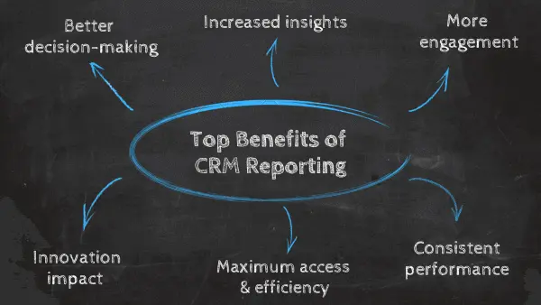
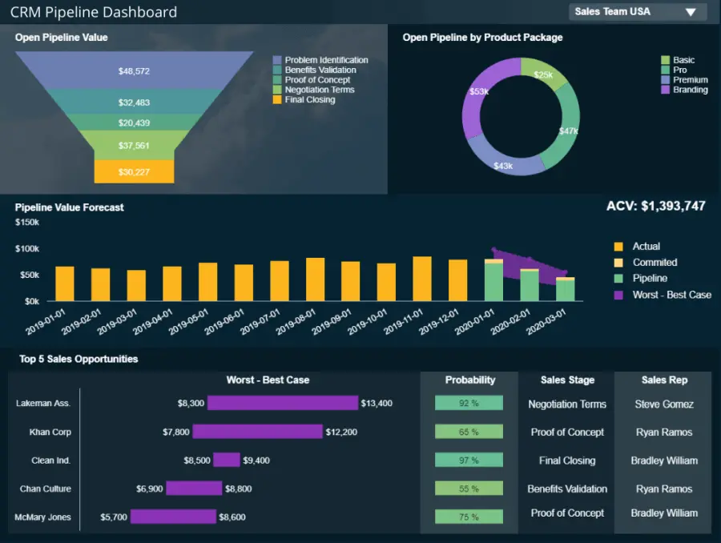

撇开利基或行业不谈，毫无疑问，您的客户是您整个运营的心脏。为了确保您面向客户的沟通和工作不断改进和发展，投资于客户关系管理 （CRM） 至关重要。

为了在当今日益残酷的数字战场上取胜，深入了解客户最迫切的需求、行为、目标和偏好，同时为他们最大的痛点提供直接解决方案，这将使您在竞争中领先十步。CRM软件是带您到达那里的容器。

 

借助功能强大的[仪表板制作工具](https://www.datafocus.ai/infos/dashboard-creator)，您可以跨接触点优化客户关系的各个方面，以最大限度地提高绩效、提高服务水平并最终发展业务。

为了将CRM软件（或客户关系管理仪表板软件）的强大功能置于生动，呼吸，现实世界的视角中，我们将更详细地探索CRM仪表板，从此类仪表板和报告的基本定义开始，同时考虑如何使用CRM仪表板软件来促进业务发展。

最后，我们将向您展示一个现实生活中的示例，以便您可以直观地了解本文中讨论的要点并更清楚地了解这些要点。

让我们开始吧。

您的机会：[想要构建专业的CRM报告和仪表板吗？](https://www.datafocus.ai/console/)探索我们的现代仪表板软件 14 天，完全免费！

## 什么是 CRM 仪表板？

CRM 仪表板是一个集中的信息中心，它以动态、交互式的方式呈现客户关系管理数据，并提供对大量见解的访问，这些见解可以改善面向消费者的策略和通信。

此外，CRM 仪表板工具提供对见解的访问，这些见解通过[在线数据可视化工具](https://www.datafocus.ai/infos/data-visualization-tools)支持的一系列特性和功能，提供客户驱动的绩效和活动的简明快照。

CRM仪表板软件的核心是数据分析和商业智能的智能容器 - 数字创新，承载着大量有见地的CRM报告。让我们更详细地看看它的力量。

## 什么是客户关系管理报告？

CRM 报告是一种管理工具，可统一销售、营销和客户支持数据以加强您的客户关系。它们存在于 CRM 仪表板中，这些仪表板以一种使您的 CRM 分析具有交互性、集中性和高效性的方式连接您的数据。

CRM报告是客户关系管理的呈现方面。通过使用可视化的关键绩效指标 （KPI） 和交互式图表和图形的组合，您可以使用 CRM 仪表板来发现趋势，使您能够制定策略，在可持续的基础上建立信任和品牌忠诚度。

## CRM报告的主要好处

现在我们已经了解了 CRM 仪表板和报告的基础知识，让我们更详细地探讨数据驱动的客户关系管理仪表板的业务提升优势。

### 1\. 更好的决策

CRM 报告工具将帮助您根据强大、可靠的可视化数据做出更快、更明智的决策。

通过能够执行质量[KPI 跟踪](https://www.datafocus.ai/infos/kpi-tracking-software-and-tools)，您将实时将信息转化为洞察力。改进的决策不仅会让您更好地适应变化，还可以简化您的客户服务运营，同时减少时间和成本消耗效率低下。

### 2\. 增加洞察力

CRM 报告软件根据历史、预测和“当下”数据为您提供深入的见解。

CRM 仪表板提供的可消化的视觉信息将使您能够发现新兴趋势，确定优势和劣势，并最终满足客户的需求。

### 3\. 更多参与度

CRM报告的最大好处之一是有效的活动跟踪。如果操作正确，它将使您能够汇编与客户在不同接触点的行为和偏好相关的相关信息，并了解您的营销活动是否有效。

通过这样做，您可以在客户参与度最高的地方与他们会面，并提供消息传递、优惠、交易、折扣、建议和解决方案，从而提高客户忠诚度和品牌宣传度。

这些类型的结论可以在归因建模的帮助下得出。这种做法允许您通过跟踪上次互动、上次非直接点击和线性归因等指标来了解哪个广告系列渠道对您的客户更有效。

### 4\. 稳定的性能

CRM报告允许您设置可操作的基准，同时精确地监控您在各个领域的表现。

借助正确的 CRM 分析报告，您可以始终如一地构建面向客户的活动，在获取和留住大量新客户的同时提高您的品牌声誉。

### 5\. 最大访问和效率

由于CRM报告技术是集中的（您可以从一个平台访问大量以消费者为中心的数据），并且业务中的每个人都可以访问，因此您将为您的公司提供通过数据分析的力量取胜的工具。

借助CRM报告，您可以为客户服务部门的每个人提供工具，以通过数据分析提高其绩效。当您这样做时，沟通将得到改善，生产力将提高，您将能够从商业智能 （BI） 的力量中受益，24/7。

### 6\. 创新影响

使用 CRM[仪表板工具](https://www.datafocus.ai/infos/online-dashboard)时，您正在培养客户服务创新文化。

许多企业错误地将营销和客户服务视为一系列临床交易。但是，如果您能够跳出框框思考，用您的服务让客户眼花缭乱，并开发提供真正价值的消息传递，那么您将推动自己领先一步。CRM报告技术将帮助您做到这一点。

“数据只是数千个故事的摘要 - 讲述其中的一些故事以帮助使数据有意义。

您的机会：[想要构建专业的CRM报告和仪表板吗？](https://www.datafocus.ai/console/)探索我们的现代仪表板软件 14 天，完全免费！

## 如何创建高质量的CRM报告？

现在我们已经对这些CRM分析工具有了基本的了解，是时候考虑如何制作它们，以及一些要遵循的基本步骤了。在这里，我们深入研究了最佳实践、方法和方法，这些实践、方法和方法将帮助您使 CRM 仪表板工具适合您的业务。

### 1\. 使用专业的CRM报告工具

为了在坚实的基础上构建您的计划并从数据驱动的见解中榨取最后一滴价值，使用正确的[BI 报告工具](https://www.datafocus.ai/infos/bi-reporting)至关重要。没有例外，没有妥协。

动态[KPI 仪表板](https://www.datafocus.ai/infos/best-kpi-dashboard-examples)将构成您的报告和分析计划的基础。当您研究如何制作它们时，了解强大的CRM报告工具的重要性至关重要。

专业的CRM报告技术是交互式的，可定制的，并且在使用数据讲述有效故事方面具有丰富的潜力。

从客户关系管理的角度来看，CRM仪表板工具一目了然地提供了大量宝贵的数据，使其为响应式决策量身定制。

像DataFocus这样的CRM报告工具不仅可以提供面向客户的关键信息的无价快照，还可以在各种设备（包括平板电脑和智能手机）上24/7全天候访问数据驱动的见解。

### 2\. 调整您的目标和目的

使用正确的CRM报告工具时，您应该首先仔细研究企业面向客户的核心目标。

您想建立社交媒体参与度吗？您是否希望提高现有客户忠诚度？您想使您的内容营销活动更加集中还是简化您的客户服务支出？想想你想做什么以及为什么要这样做。

一旦您调整了基于消费者的宗旨、目标和目标，您将能够为工作选择最佳 KPI - 为您的 CRM 仪表板设计注入活力的可视化。

为了激发您的客户关系管理报告来管理您的指标，请探索我们精选的[KPI 示例](https://www.datafocus.ai/infos/kpi-examples-and-templates)。

### 3\. 考虑您的受众

在构建任何类型的质量报告时，考虑受众是迈向成功的基本一步。通过根据他们的需求生成它们，您将确保每个用户都可以从报告过程中挖掘最大潜力。在CRM方面尤其如此，因为该学科包括多个业务部门和利益相关者，他们将需要这些报告用于不同的目的。其中一些主要参与者包括：

- 销售：销售部门使用CRM仪表板来监控业务管道，并确定最相关的潜在客户和机会的优先级。借助正确的[在线数据分析工具](https://www.datafocus.ai/infos/data-analysis-tools)，该团队可以跟踪单个座席的绩效、潜在客户进度以及准确的销售预测。
- 营销： CRM的营销部分涵盖了与潜在客户生成相关的所有方面。营销部门的 CRM 报告应包括电子邮件点击量、潜在客户来源和活动开发等指标。他们使用所有这些信息来提高转化率。
- 客户支持：支持团队可以通过深入了解票证工作流程从这些工具中受益。他们的报告应包括平均工单响应时间或当前正在处理的工单数量等指标。像这样，他们可以更全面地了解性能并确保出色的客户体验。
- C级高管：最后但并非最不重要的一点是，C级高管通过获得与客户关系相关的所有内容的360视图，从CRM报告中受益。他们不需要详细介绍我们上面提到的每个领域，但他们需要了解当前状态，哪些进展顺利，哪些需要优化。

### 4\. 选择正确的数据源

为了提供我们上面提到的所有玩家所需的见解，您需要收集正确的数据。CRM分析可以在各种内部和外部资源的帮助下完成，这些资源可以在[数据连接器](https://www.datafocus.ai/infos/data-connectors)等现代技术的帮助下合并在一起。其中一些来源包括：

- 引荐来源：这将使您了解新客户从哪里了解您的产品/服务。推荐可以来自Facebook广告，电子邮件或Instagram帖子，仅举几例。
- 过去的购买：通过查看过去的购买，您可以在目标客户中找到各种行为模式，并使用它们来产生有针对性的体验。
- 电话：许多企业通过电话联系潜在客户。此信息将告诉您销售代表需要呼叫可能转化的潜在客户多少次，并找到改进机会以使其成功实现。
- 营销数据：这可以包括社交媒体以及网络分析。这些数据将通过了解老客户和潜在客户的相似之处来帮助您优化营销工作。这将帮助您提供个性化的交互。

这些只是可用于生成报告的几个 CRM 数据库示例。这里的一个重要注意事项是使用自动化工具来处理数据，以便为分析做好准备。这些工具将确保正确处理任何不正确的数据，以免干扰分析。

### 5\. 完成你的叙述

您可能还记得我们之前提到过数据故事。人脑对讲故事的反应最好，最好的CRM报告提供了大量的范围来讲述你的数据的故事。

强大的CRM仪表板模板将允许您根据受众的目的，目标和偏好自定义可视化和[设计格式](https://en.99designs.de/blog/tips/principles-of-design)。如果您专注于这样做，引导您的用户完成引人入胜、易于遵循的叙述，您将从客户关系管理报告指标中榨取最后一滴价值。

我们的[数据可视化技术](https://www.datafocus.ai/infos/data-visualization-techniques-concepts-and-methods)实用指南将告诉您有关使用 CRM 仪表板示例数据创建有效消息的所有信息。

### 6\. 为仪表板成功而设计

无论您是在查看消费者管理仪表板和报告，您使用的每个 CRM 仪表板模板都应该在设计方面是最佳的。

当我们说“最佳设计”时，我们并不是指将成堆的信息塞进一个空间或过度尝试颜色。不，我们的意思是根据经过验证的仪表板设计原则开发逻辑格式。

在设计销售CRM仪表板或任何其他形式的客户关系报告时，您应该牢记您的核心目标，有条不紊地描绘出每个用户都可以一目了然的画面。

为了帮助导航仪表板设计工作，以下是报告成功的一些最佳做法：

- 确保视觉对象和数据以合乎逻辑且可扫描的方式排列。设身处地为通用用户着想，以尽可能轻松地提取信息和采取行动的方式安排您的CRM仪表板。
- 不要在任何 CRM 报告样本上使用超过三种颜色，因为这只会让人眼前一亮，并减损页面上的信息。
- 当涉及到 CRM 报告示例时，请在页面上使用历史、预测和实时见解的平衡组合来提供价值。偏向一组特定指标会使报表变得肤浅，并阻碍整体设计。
- 尽可能使用空白，如果可能，请将边距加倍。

有关仪表板设计技巧等的完整概述，请浏览有关如何[创建仪表板](https://www.datafocus.ai/infos/dashboard-design-principles-and-best-practices)的完整指南。

### 7\. 探索不同类型的 CRM 报告

您的企业可以在多个领域从智能CRM报告中受益。让我们快速浏览一下当今快节奏、高度互联的商业世界中可用的六种主要类型的 CRM 报告。

- 盈利能力和收入报告 基于仪表板的报告，提供[销售 KPI](https://www.datafocus.ai/infos/kpi-examples-and-templates-sales)的详细细分，例如消费者层面的主要收入来源。跟踪这种类型的报告将清楚地表明您应该将销售和营销工作重点放在何处。
- 管道报告： 这些类型特别有效，因为它们将帮助您跟踪潜在客户在销售渠道中的进度。使用管道报告将使您能够简化销售流程，同时增强客户沟通。
- 销售转化报告：CRM报告的这个分支对于各行各业的销售和营销团队至关重要，因为它分解了您的转化数据，以深入了解您的潜在客户来源以及潜在客户或潜在客户的质量。
- 销售周期CRM报告：这些报告工具非常有效，因为它们提供了优化每个阶段和接触点的销售周期所需的所有可视化数据，以实现最大的效率和投资回报率。
- 目标基准报告：以目标为中心的CRM式报告提供了各种战略和活动如何与预定基准一起执行的详细快照 - 提供旨在发现组织优势和劣势的基本见解。
- 营销投资回报率报告：[营销BI](https://www.datafocus.ai/infos/business-intelligence-marketing)分析的重要工具。基于投资回报率的报告可以深入了解促销活动的效果，同时根据渠道或活动提供清晰的收入来源细分。

### 8\. 从预测中受益

预测分析是一种通过分析当前和历史数据来准确预测未来性能的技术。这使员工能够为可能的结果做好准备并利用任何潜在机会。由于所有这些原因，必须在CRM仪表板中包含预测。例如，财务预测允许公司预测未来的收入和支出。另一方面，销售预测可以帮助销售团队预测未来的收入增长，并根据潜在客户信心调整其管道估计。我们将在下面的CRM模板之一中看到此功能。

### 9\. 教育、启发、赋权

在投资[数据分析工具](https://www.datafocus.ai/infos/data-analyst-tools-software)时，许多企业忽视了信息可访问性的重要性。即使是最好的CRM仪表板，也只有在组织内的少数人使用它们的情况下才能做这么多。

也就是说，当您设置 CRM 仪表板时，您应该始终考虑客户服务、销售和营销中的各种人员如何受益。

通过向合适的人员授予适当的权限，并举办针对特定角色的研讨会，了解如何从相关CRM报告中获得最佳收益，您将最大限度地提高报告工具的价值。反过来，您将加速业务的增长。

### 10\. 测试、调整、发展

如果您已经检查了各种 CRM 报告示例和 CRM 仪表板示例，并遵循了我们所有的客户关系报告构建建议，那么您很可能会获得 CRM 报告的所有好处

然而，我们生活在一个数字时代，工具、技术和前景在不断变化。当问自己“什么是CRM报告？”这个问题时，重要的是要记住答案在于不断发展。

虽然您的报告今天可能提供CRM报告的所有好处，但明年它们的效果可能会大大降低。关键是，您的CRM报告活动应始终保持活动状态。

花时间分析、探索、测试您的 CRM 报告样本，并定期寻求反馈。这样做将确保您进行调整、编辑和升级，从而为您提供对不断发展、残酷的商业环境的最佳见解。

您的机会：[想要构建专业的CRM报告和仪表板吗？](https://www.datafocus.ai/console/)探索我们的现代仪表板软件 14 天，完全免费！

## 真实世界的 CRM 仪表板示例

现在您已经了解了创建成功的 CRM 报告的关键要素，我们将看看四个尖端的 CRM 仪表板示例。

CRM不仅仅是客户服务监控工具。通过针对您的特定目标、目的和需求使用正确的[数据仪表板](https://www.datafocus.ai/infos/data-dashboards-definition-examples-templates)，您将获得销售、营销、客户服务、人力资源、财务和采购部门的全景视图。反过来，您将深入了解整个组织如何协调一致地工作以使您的客户受益。

这些是可以从强大的CRM KPI仪表板中受益的主要业务领域。在提供对大量面向客户的不同部门和职能的运营和行为洞察的同时，还可以将 CRM 分析拆分为运营、分析和战略，具体取决于您要通过仪表板实现的目标。

为了正确看待这些想法，让我们看一下使用现代[仪表板创建器](https://www.datafocus.ai/infos/dashboard-creator)生成的四个真实 CRM 分析示例：

### 客户关系管理关键绩效指标仪表板

主要关键绩效指标：

- 潜在顾客响应时间
- 随访联系率
- 销售活动
- 平均合约价值
- 平均销售周期长度

我们的第一个CRM仪表板示例配备了KPI的完美风暴 - 旨在改善潜在客户交货时间，后续响应率，销售周期长度，合同价值和核心销售活动的可视化指标。

以平衡和合乎逻辑的形式呈现，销售代表和经理可以快速做出决定，跨渠道吸引潜在客户，同时制定策略以提高转化率，降低运营效率低下，并最终增加收入。

通过将此CRM仪表板模板添加到组合中，您将优化销售，进而优化客户服务以及营销部门，以实现持续增长，发展和成功。

### 首席营销官仪表板

主要关键绩效指标：

- 销售目标和增长
- 网站流量与潜在客户比率
- 每条线索的成本
- 潜在客户与 MQL 比率
- MQL 与 SQL 比率

我们的下一个CRM仪表板是B2B SaaS业务的完美用例示例，对于这些业务而言，良好的CRM管理尤为重要。[CMO 仪表板](https://www.datafocus.ai/infos/dashboard-examples-and-templates-marketing)配备了一系列高级指标，适合忙碌的首席营销官希望产生真正的影响。

这是一个要求苛刻的角色，需要无休止的组织工作，CMO几乎没有时间研究和分析低层次的数据和见解。这个尖端的CRM仪表板模板旨在简化决策过程，同时促进创新的增长战略，将提供健康的营销投资回报（ROMI），同时增强您面向客户的沟通。

此外，通过先进的 KPI，包括每个潜在客户、每个 MQL、每个 SQL 和客户的成本，所有这些都基于一个目标，您将能够减少不必要的成本，同时提供您的各种策略和计划的价值。

### 客户关系管理机会仪表板

主要关键绩效指标：

- 销售机会数量
- 销售机会得分
- 平均购买价值

毫无疑问，销售和客户服务是交织在一起的。通过改进您的销售和消费者营销方法，您将加强您的一线服务 - 这个 CRM 仪表板模板将帮助您做到这一点。

我们的 CRM 机会仪表板旨在帮助您的销售代表磨练新兴潜在客户并采取正确的行动方案。 包括销售机会得分、销售机会数量和平均购买价值在内的 KPI 和谐地工作，形成一个视觉信息的挂毯，不仅有助于确定销售机会的优先级，而且引导用户找到他们应该关注的策略或接触点，以完成更多销售。

通过把握好时机、策略和沟通，您将更有效地管理客户关系，从而增加收入和提高底线。此CRM报告示例将带您实现目标。

### CRM 管道仪表板

主要关键绩效指标：

- 年度合同价值 （ACV）
- 开放管道价值
- 按产品包打开管道
- 管道价值预测

我们的下一个也是最后一个CRM模板是销售渠道仪表板。管道概述可以说是任何客户关系管理仪表板都应包含的最重要的元素之一。在这种情况下，我们看到了一个复杂的开放管道，非常适合B2B业务。我们说它很复杂，因为它有不同的阶段，而不是显示每个阶段的潜在客户数量，而是概述了转换每个客户的货币价值。与这些信息配对，然后按产品包细分开放管道，这意味着对每个包感兴趣的潜在客户的价值。从这里提取的见解可以告诉销售团队将精力集中在何处。

仪表板的底部再次提供有关过去 12 个月的开放管道的信息，最后是 3 个月的预测。如前文所述，在成功的CRM分析方面，预测至关重要，因为它可以让您提前为可能出现的任何趋势做好准备。最后，我们得到一个图表，显示前 5 个销售机会，其中包含对最佳和最坏情况、完成交易的概率、销售阶段和负责代表的见解。概率分数基于交易所处的阶段，它们在漏斗中最低，最有可能转化。

 

## CRM 报告中应包含哪些内容？

 

到目前为止，我们已经提到了模板列表、好处和关键步骤，以实现成功的 CRM 报告流程。虽然此时您可能已经清楚地了解了它，但如果不总结任何值得一提的 CRM 报告中应包含的关键要素，我们就无法完成这篇文章。

 

- 销售渠道：CRM报告应提供所有当前交易的进度及其当前阶段的详细概述。它应该提供对正在进行的交易、需要立即完成的紧急交易，甚至是那些不起作用的交易的见解，以便团队可以从中学习。
- 一般和个人销售代表绩效：根据公司的规模，您的销售团队将每天与潜在客户进行各种电话、电子邮件或一般沟通。为了充分利用此过程，有必要跟踪一般和个人绩效。这将使您能够识别弱点以进行改进并确保您的潜在客户转化为客户。
- 营销绩效： 您的促销工作将直接影响组织获得的潜在客户数量。出于这个原因，在您的报告中包括营销绩效的概述对于了解哪些是有效的以及可以改进的内容以确保公司从其营销工作中获得公平的投资回报率至关重要。
- KPI：KPI 可以说是最重要的组成部分，可让您衡量实现一般业务目标的进度。它们使您可以确定要关注的最重要区域，以避免浪费时间在黑暗中拍摄。如前所述，CRM涵盖了销售，营销和客户支持等各个领域，并且良好的报告应提供达到这些KPI的KPI。
- 交互功能：虽然这不是我们刚刚提到的特定部分，但它是一个基本功能，允许用户从数据中提取最大潜力。交互式仪表板功能允许您使用过滤器浏览报告。这样，您可以找到关键问题的答案，而无需从一个仪表板切换到另一个仪表板，您可以在一个集中的位置获得所需的一切。

您的机会：[想要构建专业的CRM报告和仪表板吗？](https://www.datafocus.ai/console/)探索我们的现代仪表板软件 14 天，完全免费！

## 关于CRM报告的最终想法

 

我们已经回答了“什么是 CRM 报告？”这个问题，深入研究了 CRM 报告和 CRM 仪表板示例，并介绍了如何创建您自己的以客户为中心的报告。有一点很清楚：数据驱动的仪表板分析是通往消费者驱动成功的途径。

 

如果您希望简化以客户为中心的流程，提供满足受众确切需求的锐利服务，并成为真正的创新者，CRM 报告工具是前进的方向 - 没有竞争。

 

通过专注于您的客户并提供针对受众直接需求的宝贵活动、通信和服务，您将在竞争中获得至关重要的优势。此外，如果您想深入了解您的销售数据，请阅读我们关于[salesforce 报告的](https://www.datafocus.ai/infos/salesforce-reports-examples-and-templates)权威指南。

 

现在轮到您利用我们完全免费的[14 天免费试用](https://www.datafocus.ai/console/)版来拥抱数据驱动型仪表板的强大功能了。
