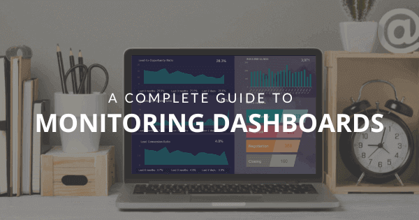

多年来，数据监控一直在改变商业格局。也就是说，企业管理来自各种来源的大量非结构化数据并不总是那么容易。与之匹配，缺乏具有技术技能的用户导致报告的生成时间推迟到了数周。到报告准备就绪时，由于当今环境的快节奏特性，数据已经失去了它的价值。事实上，专家表示，美国公司每年在保持数据最新和有用相关的问题上损失超过6000 亿美元。

考虑到这一问题，数据专业人员开发了各种[在线数据分析工具](https://www.datafocus.ai/infos/data-analysis-tools)，可帮助组织进行数据管理过程，从收集到分析，所有这些都在一个中央位置实时监控。进入监控仪表板。商业智能和分析行业最伟大的创新之一。

如果您对监控仪表板的工作原理感到好奇，在这份富有洞察力的指南中，我们将涵盖与这些强大的分析工具相关的所有方面。我们将介绍监控仪表板的定义、优势、设计技巧和一系列模板列表，您可以使用这些模板来了解仪表板监控的价值。让我们从定义开始吧！

## 什么是监控仪表板？

监控仪表板是在线分析工具，可实时提供相关 KPI 的集中视图。由于监控仪表板的直观界面，企业可以快速发现效率低下的地方，并优化其性能以实现持续增长。

上图是一个销售监控仪表板的示例。这些工具提供了一个集中位置，可以将您最相关的关键绩效指标合并在一起，并确保实现您的目标。他们提供的交互性水平使您可以浏览数据，以找到可以提升策略的隐藏见解。

如果没有[在线仪表板](https://www.datafocus.ai/infos/online-dashboard)，公司将不得不处理大量非结构化数据。这些工具有用户友好的界面，使每个人都无需技术技能即可从中提取相关见解。

如前所述，企业在试图保持数据最新的过程中损失了大量资金。市场竞争日益激烈已经不是什么秘密了，谁不利用数据优势为自己谋利，谁就会落后。监控仪表板可以解决这个问题，这要归功于它们的实时性，它允许用户在任何时候都掌握其性能，并在出现任何问题时立即解决。

## 为什么需要监控仪表板？

在组织内部引入数据驱动的文化并非易事。幸运的是，交互式监控仪表板等[BI 解决方案](https://www.datafocus.ai/infos/business-intelligence-bi-solutions)通过使数据大众化并使每个关键参与者都可以访问数据，从而促进这项任务。为了继续审视仪表板监控工具的价值，我们现在将列出一些企业可以从将它们实施到分析过程中获得的几个主要好处。

- **用户友好的数据处理方法**：扩展上述观点，任何试图利用其数据的企业面临的最大挑战之一是缺乏技术技能，因为大多数普通用户都感觉受到数据的威胁。事实上，几十年来，分析任务一直委托给 IT 部门，让 IT 员工疲于于工作和生成报告。有了监控报告，这将不再是问题。它们提供了一个用户友好的界面，允许任何类型的用户在几分钟内生成[业务仪表板。](https://www.datafocus.ai/infos/dashboard-examples-and-templates)随着时间的推移，这将使所有员工能够在他们的决策过程中使用数据，而无需任何事先的技能。
- **明智的决策：**考虑到竞争日益激烈，想要比同行更成功的企业根本不能在重要决策方面盲目行事。监控报告提供对您最重要的绩效指标的实时访问，以便您可以随时随地支持任何相关讨论。使用监控仪表板，无需等待数天或数小时即可获取数据或根据直觉做出决策，您需要的所有信息都触手可及，一旦发生任何事态就可以立即采取行动。
- **协作环境：**协作是数据的关键。现代[在线报告软件](https://www.datafocus.ai/infos/online-reporting)提供了通过不同渠道和格式与任何利益相关者轻松共享监控仪表板的可能性。这要归功于这些工具的在线特性。能够共享仪表板和报告，使他们通过数据保持联系来增强不同团队之间的协作。随着时间的推移，这会在企业内部形成一种有凝聚力的文化，从而引领它从竞争对手中脱颖而出。

## 监控仪表板设计的 5 个技巧

这些只是富有洞察的工具带来的众多好处中的一小部分。现在，您可能想知道，我如何创建它们？就像任何其他过程一样，生成仪表板需要您遵循一些最佳实践，以确保您从中挖掘出最大的潜力。设计不正确的仪表板弊大于利。因此，为避免这种情况发生在您身上，我们在这里列出了监控仪表板设计的 5 大技巧。

### 1\. 定义总体目标和受众

创建它们的第一步是考虑您的目标和受众。当谈到如何最大限度地挖掘这些工具的最大潜力时，没有一种万能的方法。相反，根据受众的需求定制它们是最好的方法。为了实现这一点，有必要与所有利益相关者坐下来，并定义明确的目标，这些目标将作为在您的仪表板中包括哪些度量的指南。

另一个重要方面是考虑受众的知识水平。如果您向不熟悉其中某些指标的客户或团队成员展示[财务报告](https://www.datafocus.ai/infos/daily-weekly-monthly-financial-report-examples)，则应确保包含简要说明，以方便他们浏览仪表板的方式。确保你讲的是一个连贯的故事，让人一目了然。这是一个真正需要考虑的设计步骤，因为对数据的错误解读会严重损害您的决策过程。

### 2\. 选择相关的 KPI 和指标

扩展上述观点，一旦您定义了受众的核心目标和需求，就该选择有助于您讲述故事的 KPI 和指标了。也就是说，一种普遍的误解是，任何可以测量的东西都需要被测量。在涉及监控仪表板方面，这与事实相去甚远。您所需要讲述的数据故事的空间是有限的，因此，有必要只选择能够提供额外价值且不会偏离分析目的的指标和 KPI。

这里要考虑的另一个重点是将指标与 KPI 区分开来的重要性。为此，您可以查看我们的[KPI 与指标](https://www.datafocus.ai/infos/kpis-vs-metrics-differences)博文。

### 3.选择正确的视觉类型

我们的第一个技巧集中在规划阶段，现在我们将介绍一个涉及仪表板实际生成的基本技巧。一旦您定义了要描绘的指标和 KPI，您就需要定义将使用哪种[类型的数据可视化](https://www.datafocus.ai/infos/how-to-choose-the-right-data-visualization-types)来执行此操作。有很多图表类型可供您选择，但是，重要的是要考虑到并非所有指标都能用任何类型的图表来最好地表示。例如，折线图和柱形图最适合显示特定趋势，而饼图最适合显示数据的组成。

使用错误的图表可能会使您的数据产生误导，并且更难理解。因此，花时间仔细考虑哪种类型的视觉效果最适合您的 KPI 是很重要的。

### 4\. 使用 10-15 秒规则

监控仪表板过度拥挤，会破坏整体目的，并且变得毫无用处。您放置图表和图形的方式以及您决定集成的数量将显着影响仪表板的感知方式。为了帮助解决这个问题，您可以使用 10-15 秒规则作为指导。

本质上，这条规则规定用户应该能够在 10 到 15 秒内浏览所有最重要的信息。如果花费的时间比这更长，则监视器仪表板很可能过于拥挤且难以阅读。设计的目标应该是保持可视化的干净和集中。始终重新审视设计以确保其正常工作。

### 5\. 受益于交互式过滤选项

最后，在构建监控报告时，您应该受益于高级过滤器。[BI 仪表板工具](https://www.datafocus.ai/infos/bi-dashboard-tools)提供了使用各种交互过滤器的可能性，有助于用户导航仪表板的方式。例如，[向下钻取](https://www.datafocus.ai/infos/drill-down-drill-through-reports)过滤器允许您在一个图表中探索较低级别的分层数据。这样一来，您就可以避免在仪表板中使用多个图表导致过于拥挤，同时仍然可以在一个中心位置获得任何关键问题的答案。

如果您想将您的技能提升到一个新的水平，可以查看我们关于[仪表板设计](https://www.datafocus.ai/infos/dashboard-design-principles-and-best-practices)的专门帖子。现在让我们看一些针对不同行业和功能的真实监控仪表板示例。

## 监控仪表板模板和示例

现在我们已经讨论了一些设计技巧和最佳实践，是时候看看最终结果会是什么样子了。在这里，我们将展示 5 个针对不同功能和行业的监控仪表板示例，以不断了解这些分析工具的强大功能。让我们从销售模板开始吧！

### 1\. 销售监控仪表板

我们的第一个监控仪表板模板涵盖了与销售部门业绩相关的基本指标，重点关注销售目标和增长。通过提供多种交互式的视觉效果，管理人员可以实时跟踪其业绩的各个相关方面，并轻松对其进行优化，以确保实现目标。

销售经理需要经常访问这些指标，以确保一切顺利进行。例如，销售目标 KPI 可以告诉他们团队是否实现了目标，或者是否需要改进。这些信息可以与过去 12 个月的 ARPU、CLV 和 CAC 等相关指标的历史数据相辅相成。结合当前和历史的洞察，使用户能够识别隐藏的趋势，帮助他们不仅仅是基于直觉制定明智的策略。

### 2\. 社交媒体监控仪表板

社交媒体渠道在快节奏的环境中发挥作用，要求品牌和企业时刻掌握任何新发展，保持与时俱进，并建立忠诚的社区。考虑到这一点，一个具有实时洞察力的社交媒体监控仪表板会成为保持领先于竞争对手的宝贵工具。

通过结合[营销 KPI](https://www.datafocus.ai/infos/kpi-examples-and-templates-marketing)，该记分卡仪表板提供了对 4 个关键社交媒体渠道绩效的洞察：Facebook、Twitter、Instagram 和 YouTube。每个指标都受到实时监控，并与预期目标进行比较。鉴于社交媒体策略的时效性，仪表板可以一目了然的看出哪些领域需要改进。只需查看红色的指标，用户就可以轻松了解他们需要集中精力进行改的地方。这样，他们可以随时处理任何问题并确保出色的性能。

### 3.服务监控仪表板

如果不讨论对任何企业来说最重要的领域之一，就不可能正确地看待监控仪表板的价值。是的，我们说的是客户服务。客户是任何组织的支柱，让他们满意应该始终是重中之重。值得庆幸的是，企业在做出这些决定时不需要在黑暗中摸索，他们只需查看数据即可找到需要的所有答案。

考虑到这一点，此[客户服务仪表板](https://www.datafocus.ai/infos/dashboard-examples-and-templates-customer-service)提供了对服务团队绩效的洞察。借助解决率和平均响应时间等指标，团队可以轻松描绘出他们为客户提供的服务类型，并对其进行分析，以找到个人和团队层面的改进机会。

### 4\. 健康监测仪表板

[医疗保健商业智能](https://www.datafocus.ai/infos/healthcare-analytics)在许多方面彻底改变了患者护理。能够在集中位置（例如监测仪表板）中可视化他们最相关的数据源，使医护人员能够解决任何瓶颈并发现趋势，以确保他们在护理设施中提供出色的护理和愉快的体验。我们的下一个示例就是这样做的，它为高层管理人员提供了医院绩效的整体视图，使他们能够将人力和金钱资源集中在最需要的地方。

如上所述，此示例提供了与运营和财务相关的指标的整体视图。按部门KPI划分的患者会告诉经理哪个区域更需要员工来满足患者的需求。另一方面，按部门划分的平均等待时间可以帮助发现有问题的单位。病人等待看专科医生的时间过长，可能会导致医护人员缺乏培训，或者单位人手不足，需要更多的护士和医生。

### 5\. CFO 监控仪表板

首席财务官(cfo)可能比其他任何首席执行官级别的职位更能从一个工具中显著获益，这种工具不仅能监控与财务有关的实时数据，还能监控客户和员工满意度。我们下面的[财务仪表板](https://www.datafocus.ai/infos/dashboard-examples-and-templates-finance)就是这样做的！

这个模板之所以如此有价值，是因为它提供了对复杂业务指标的简化视图。收入、毛利润、息税前利润、营业费用和净收入等关键指标，都以直观[的仪表图](https://www.datafocus.ai/infos/gauge-chart-examples)进行描述，并与目标进行比较。这使得CFO 可以一目了然地发现其中一个指标没有按照预期执行，并立即实施纠正措施。

## 关键要点监控仪表板

如果您已经了解了这一点，那么您必须意识到专业的监控报告和仪表板会如何彻底改变您处理数据的方式。几十年来，企业一直在努力保持他们信息的时效性，并及时采取行动。多亏了现代[商业智能工具](https://www.datafocus.ai/infos/best-bi-tools-software-review-list)，这不再是一个问题。这些技术的自助服务和交互式特性提供了一种快速且可访问的方式来管理数据，并将其用作一种竞争优势。

如果您已准备好开始做出基于数据的决策，并希望将您的分析提升到一个新的水平，欢迎尝试我们的监控仪表板软件，[免费试用30天](https://www.datafocus.ai/console/)！
