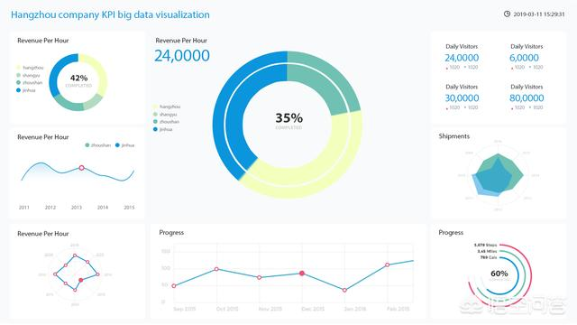
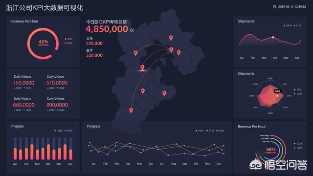
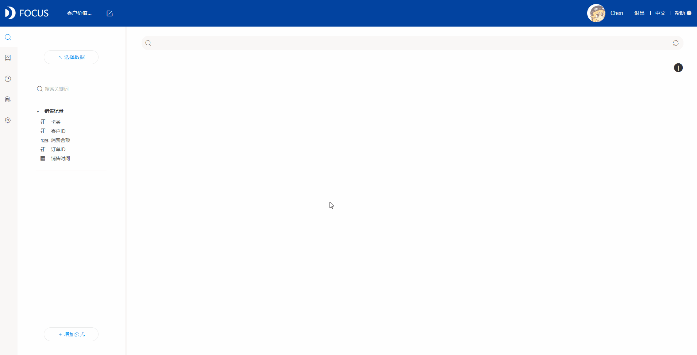
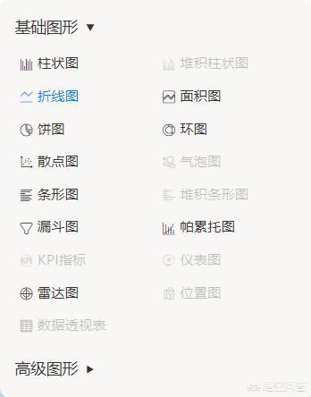
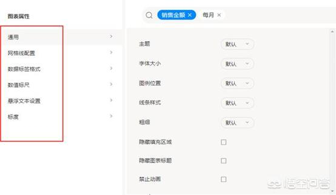
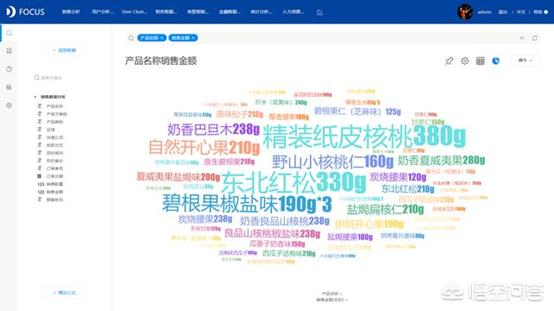
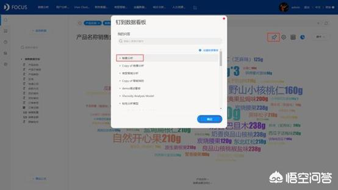
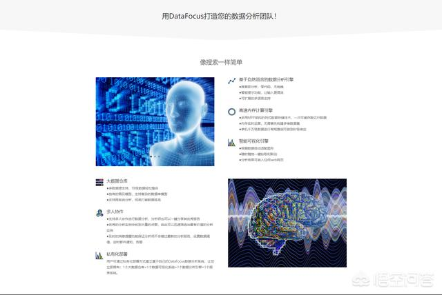

说到数据分析，其实很多人都用过excel做过简单的数据分析，也都知道用excel来做数据分析还是有一定缺陷，一是分析类型不够丰富，二是数据量过多时excel不给力，三是图表的制作比较复杂。

**那有没有更专业的可视化工具呢？**

**今天给大家推荐一款很有意思可很好用的数据分析工具：DataFocus。**

**DataFocus是一款集齐数据仓库，数据分析，数据可视化，报表系统于一身的“神器”**。它的实现方式与众不同，有自己的特色，不随大众，你肯定见过很多工具都是通过拖拽来实现的，也有通过程序代码、SQL语句来实现的，但是你肯定没有见过无需任何代码、通过**自然语言搜索**来实现的，没错，就是跟**谷歌搜索一样的搜索方式**。除此之外这也是国内首个利用搜索来进行可视化分析的数据分析工具。

听到这里是不是觉得很好奇，搜索式到底是怎么样的？

**创新的搜索式分析到底是什么？**

​别急，下面就给你展示。

搜索框内输入关键语句，系统即时返回结果，并智能适配图表，什么样的数据，最合适什么样的图表，系统会告诉你。

因为DataFocus智通搜索，并且适配图表，无需你再做其他复杂的配置，也不要任何的代码、SQL语句等等，系统全部会在后台自动处理好，而你只需要等待结果就行，简而言之，就是操作非常简单，过程非常智能，结果非常完美。

**有人就会问了，那如果想要的报表很复杂呢，也能搜索出结果吗？**

报表复杂，很大原因是输入的内容多了，限制条件多了，其实操作也是一样。

例如现在有一份销售数据，在同一个图表中，我既想显示销售数量的增长率，又想显示销售额的增长率，还想显示原始销售额和销售数量，那DataFocus可以实现吗？

当然可以，而且一次搜索就可以得到结果。

DataFocus其性价比高，制作简单，图表丰富且美观。支持各种本地数据文件或连接数据库，还有可以满足即席分析的直连数据功能，无论是导入数据还是数据处理都简单方便易操作且功能全面。除此之外，DataFocus不需要那么多的额外配置，也不需要任何代码，分分钟就能完成一个好看的可视化数据分析报告。

**那么如何制作呢？**

首先必须要了解DataFocus，只有熟悉了工具，才能更好地运用工具。DataFocus拥有30多种图表样式，分基础图形和高级图形，基本涵盖市场对图表的所有需求。

 

不同图表还可以自定义配置，比如主题、字体、样式等；

DataFocus还完美匹配移动端，随时随地都可以查看大屏，其有一个很大的特点也是它的优势之一，DataFocus制作图表采用搜索的方式，而不是传统的拖拽方式，制作方式的改变，大大地降低了可视化的难度以及复杂程度，提高了制图效率。

其次，了解DataFocus如何使用。

1、搜索出图，搜索想要可视化展示的数据，系统智能适配图表；

2、图表保存，加入大屏；

3、数据看板（可视化大屏）自定义配置，看板展示；

怎么样，这个是不是十分方便？有需要的可以get起来了~

**如果希望了解自助敏捷数据分析、数字大屏或者BI解决方案，请移步DataFocus官网，我们诚挚地欢迎您的咨询来访。**

