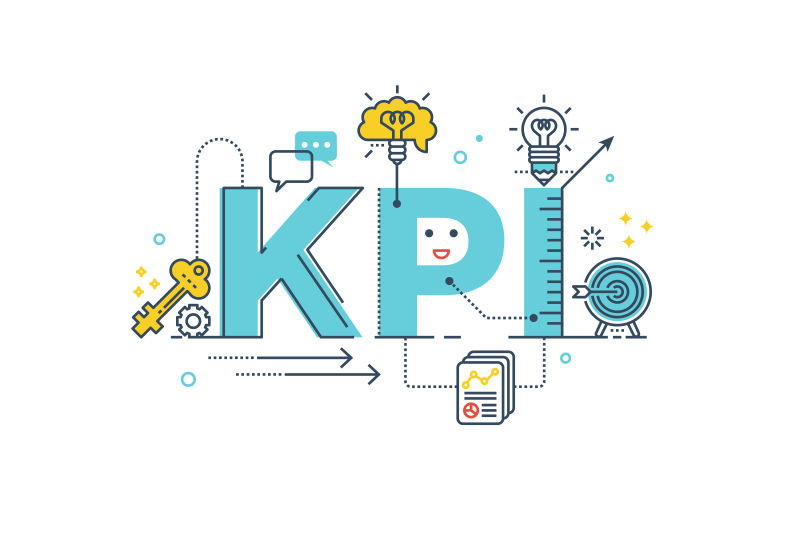

**问正确的数据分析问题，让数据说话！**

在这个竞争激烈的数字时代，设置正确的数据分析问题是至关重要的，可以决定企业的整体成功。不仅要收集所有现有数据和信息，而且要考虑以适当的方式利用好数据，这已经成为制定成功的业务战略不可或缺的价值所在。

也就是说，我们似乎正**处于数据分析危机**之中。尽管组织花费数百万美元，使用各种数据分析工具来收集和分析数据，但似乎大多数人在以可操作的、有价值的方式实际使用这些数据时遇到了困难。

**好的问题才能挖掘数据价值**

事实上，无论企业的信息技术基础设施有多先进，数据都不会提供现成的解决方案，只有好的问题才能挖掘出数据价值。

为了将数据转化为切实可行的业务决策，你应该在开始数据收集之前，就明确想要深入了解的痛点。根据企业的战略、目标、预算和目标客户，准备一组问题，用这些问题帮助企业顺利完成在线数据分析，并获得相关的见解。

DataFocus在帮助客户解决数据分析问题的过程中发现，只有好的问题才能挖掘数据价值，因此我们需要不同于以往、更灵活，与人的思维习惯相适应的数据分析工具。

在良好工具的基础上，一份数据分析问题列表，以确保您不会陷入徒劳的“事后”数据处理陷阱，并帮助您以正确的心态开始正确的数据驱动决策过程，同时获得可操作的业务洞察力。

下面就让我们将重点关注在分析数据时要问的提示和问题上，以便为有效的业务战略获得最具成本效益的解决方案。

**长期业务绩效提升的11个数据分析问题** **1) 你到底想了解什么？** 首先需要评估企业的经营状况。在全公司范围内，明确哪些关键绩效指标与业务最相关，以及你希望它们以什么方式进一步发展，确定可以进行改进的方向的地方。

如果什么都不能改变，那么分析数据也就失去了意义。但是，**如果你找到了一个发展机会，并且发现业务绩效可以显著提高，那么一个用来监控KPI的数据看板是非常重要的，**可以动态监控你的指标，并提供一个透明公开的公司业务概览。

下一步是考虑你的目标是什么，只有明确目标才能集中于目标。你认为什么样的分析结果是有效的 、成功的？先从宽泛的问题开始，比如企业年收入，再通过头脑风暴拟定一个初步的指南，用这个指南帮助你更深入地钻研，将年收入目标拆分成月度目标、拆分成各产品线目标，拆分成客户数量目标，直到拆分成可直接监控的数据指标。

 **2) 认真选择关键绩效指标** 一旦你有了数据分析的目标，下一步就需要选择一些关键绩效指标来衡量目标的完成情况。

曲卉在《硅谷增长黑客实战笔记》中提到，在建立增长模型之前需要找到一个产品的北极指标。北极星指标，又叫做OMTM，唯一重要指标。

比如LinkedIn的北极星指标是「活跃的优质用户」。对于「活跃的优质用户」的定义分为4个维度：资料完整度、好友数、可触达以及保持活跃。

LinkedIn对每一个用户都会基于这 4 个维度去定义，比如：

资料填写，每一项完成就会加几分；

好友数达到30就会是活跃度的一个拐点；

猎头是否可以直接联系到你；

一段时间内登录使用过多少次。

注意，上面的四点都是可以明确用数据衡量的，而不是模棱两可的目标，「活跃的优质用户」是LinkedIn全公司努力的目标。

现在让我们继续讨论一个最重要的数据问题——数据源。

 **3) 你的数据从何而来？** 下一步是确定需要挖掘数据的所有数据源，选择需要的字段，为未来可能需要的数据留出一些空间，并将所有数据汇总到一个地方存储。对你的数据来源持开放态度——你公司的所有部门，销售、财务、IT、运营等，能够有权限去从数据中挖掘数据潜能。

你可以使用CRM数据、来自百度统计的数据、公司的财务数据，当然利用BI软件也是有意义的，特别是现在数据量大，又分布在不同系统中，以至于电子表格的处理能力已经跟不上需求。 **4) 如何保证数据质量？** 基于不干净的“数据”得到的见解和分析，可信度堪忧。前面说了，信息来源多种多样，有好有坏。企业内的所有来源都可以提供数据，因此确定使用哪些信息以及这些信息的来源应该是关于数据分析的首要问题之一。

数据分析旨在获取对现实的清晰认识，如果你的数据不正确，你将会看到扭曲的现实。这就是为什么下一步你要“清理”你的数据集，以便丢弃错误或过时的信息。同时，及时给数据添加更多可用字段也很重要。

当你完成了确保数据质量的“打杂”工作后，你就为自己构建了一个有用的资产，即可以用统计方法进行转换、连接和测量的精确数据集。

**5) 你想应用哪些统计分析技术？**

根据我们的经验，这3种统计技术最广泛地用于商业分析中：

\-回归分析——一种统计过程，用于估计变量之间的关系和相关性。

更具体地说，回归分析有助于理解当任何一个自变量发生变化，而其他自变量保持不变时，因变量的典型值是如何变化的。这样，回归分析显示了自变量中哪些与因变量相关，并探索了这些关系的形式。通常，回归分析是基于过去的数据，让你从过去学习，以便对未来做出更好的决定。

\-群组分析——比较不同客户群体或群组在一段时间内的表现。

例如，你可以根据首次购买日期创建一组客户。随后，你可以研究不同时期的消费趋势，确定随着时间的推移，获得客户的平均质量是增加还是减少。

\-预测和说明性分析——基于分析当前和历史数据集来预测未来的可能性，包括替代方案和风险评估。

**6)需要开发ETL程序吗？**

ETL代表数据提取-转换-加载，这是一种用于从数据库中读取数据，将其转换成另一种形式并将其加载到另一个数据库中的技术。它提供了一个有用的工具，可以从外部提取数据，使其符合数据标准，并将其存储在目标数据仓库中。

如果你有大型数据集，那么明智的做法是建立一个ETL服务。当然利用DataFocus这样的软件，自带大数据仓库，可以同时搞定数据来源整合和ETL服务。

**7) 你的数据分析是为谁服务的？**

另一个重要的数据分析问题是，你的数据分析是为谁服务的？他们将如何使用你的报告？你必须了解报告的面向用户，包括：

\-他们希望从数据中获取什么

\-他们需要什么

\-他们的技术能力

\-他们可以花多少时间分析数据

了解这些问题的答案有助于帮助你决定数据报告的详细程度以及你应该重点关注哪些数据。

请记住，内部和外部用户有不同的需求。如果报告是为公司内部设计使用的，你应该知道什么样的见解对内部运营最有用，如果报告是被外界使用的，你提供的可视化报告应该易于使用且可操作。你的最终用户应该能够独立阅读和理解它们，不需要额外的支持。

**8)你应该选择什么方式来传达信息？**

你的数据是干净的，你的计算也完成了，但是数据分析还没有完成。你可能得到了很有价值的见解，但是如果不能清晰地表达出来，信息的价值将大打折扣。

数据可视化工具现在很热门，在没有数据分析师或信息技术专业人员帮助的情况下，利用数据可视化工具助力业务人员，已成为当今数据管理实践中的宝贵资源。这些工具足够灵活，可以满足用户对布局、色调等的个性化需求。 更进一步，在这些工具中实现的人工智能对发生的任何异常会做出反应，并立即发送数据警报，帮助用户即时掌握数据动态。

**9) 什么样的软件可以带来帮助？**

在上一个问题之后，我们进一步来看看什么软件可以做数据可视化。最基础的电子表格就可以搞定，但是你需要手动修改数据、编写代码，所需的时间成本和技术要求都比较高。因此，我更推荐专业的数据可视化工具。

得益于BI和AI的发展，数据分析与可视化变得前所未有的简单。强大的功能，如搜索式操作、数十种图表类型选择、快速和简便的数据源连接，以及移动端展示，使用户能够简化复杂的过程，让数据说话！

在DataFocus中，制作一张可视化大屏只需要7分钟。DataFocus支持40多种可视化图表类型，支持添加多种组件等，还提供联动、跳转、上卷下钻、筛选等交互式分析能力，便于用户构建实时分析型数据看板，驱动业务决策。

此外，现代软件不需要持续手动更新数据，但它会自动提供实时见解，帮助您回答关键问题，并为良好的分析提供稳定的基础和先决条件。

**10) 我还需要知道什么？**

**在结束之前，关于数据分析还有一个关键问题是如何验证结果。**回归到最初的目标，确保你以整体的方式看待你的数据分析结果。在这一步中，分析数据的重要问题应集中在：

\-分析得到的结论说得通吗？

\-分析得到的措施与我熟悉的业务相符吗？

你还可以使用另一种数据处理工具，对局部数据进行再计算，并比较结果。如果结果变是准确的，那么你已经建立了一个健康的数据分析与监控环境。一开始做这样的全面检查肯定不容易，但从长远来看，会带来更积极的结果。

**11) 如何创建数据驱动的文化？**

不管你是小企业还是大企业，数据的价值都值得重视，只有像数据提出正确的问题，才能得到有价值的信息。时刻记住关于数据分析的问题，并把它运用到每一天的工作中去，它能让员工做出更好的业务决策，从而创造一个经济高效的商业环境，助力企业发展。

利用数据看板是建立这样一种数据驱动型文化的好方法，就像DataFocus提供的那样：

为了真正将这种数据驱动的方法融入业务运营，组织中的所有个人，无论他们在哪个部门工作，都需要知道如何开始提出正确的数据分析问题。

他们需要理解为什么首先进行数据分析很重要。

然而，仅仅希望和希望别人进行数据分析是注定要失败的策略。坦率地说，要求他们使用数据分析(没有先向他们展示好处)也不太可能成功。

而是以身作则。向您的内部用户展示定期数据分析的习惯对于优化您的业务绩效是一种无价的帮助。试着在你的公司创造一种有益的仪表板文化。

数据分析不是约束你的员工并找出谁应该对失败负责的一种手段，而是让他们能够提高自己的绩效和自我改善。

您的机会:想通过几次点击来执行高级数据分析吗？

试用我们专业的数据分析软件14天，完全免费！

立即开始您的分析！

我们刚刚概述了一个11步的过程，您可以通过使用正确的数据分析问题来建立您的公司以获得成功。

有了这些信息，您可以概述一些问题，这些问题将帮助您做出重要的业务决策，然后建立您的基础架构(和文化)，通过准确的数据洞察在一致的基础上解决这些问题。当查看数据集时，这些是很好的问题，但不仅仅是这样，因为如果你把它们作为一个整体来利用，你可以开发一个好的、完整的数据策略。而且，如果你依赖你的数据，你只能收获长期利益，成为一个数据驱动的个人，和公司。

综上所述，以下是要问的最重要的数据问题:

1.你到底想了解什么？

2.你会用什么标准的关键绩效指标来帮助你？

3.你的数据从何而来？

4.你如何保证数据质量？

5.你想应用哪些统计分析技术？

6.需要开发哪些ETL程序(如果有)？

7.你的分析结果的最终用户是谁？

8.你应该选择什么数据可视化？

9.什么样的软件会有帮助？

10.我还需要知道什么？

11.你如何创造一种数据驱动的文化？

要开始您自己的分析，您可以试用我们的软件14天，完全免费！
