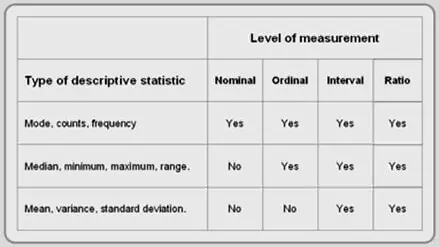

在我们竞争日益激烈的数字时代，设置正确的数据分析问题对于业务的持续增长和发展至关重要。收集企业的现有信息不仅很重要，而且您还应该考虑如何准备数据以提取最有价值的见解。

也就是说，有无穷无尽的数据需要筛选，安排您的成功见解并不总是一个简单的过程。组织可能会花费数百万美元来收集和分析各种[数据分析工具](https://www.datafocus.ai/infos/data-analyst-tools-software)的信息，但许多组织在以可操作的、有利可图的方式实际使用这些数据时却一蹶不振。

在这里，我们将探讨提出正确的数据分析问题将如何为您的分析工作提供明确的方向。我们还将探讨您应该问自己的大数据问题，以与将全力推动您的业务发展的见解联系起来。

让我们开始吧。

您的机会：[想要通过几下点击进行高级数据分析？](https://www.datafocus.ai/console/)试用我们的专业数据分析软件14天，完全免费！

## 数据与您提出的问题一样好

事实是，无论您的IT基础架构多么先进，除非您询问有关数据分析的具体问题，否则您的数据都不会为您提供现成的解决方案。

为了帮助将数据转换为业务决策，您应该在开始数据收集过程之前开始准备想要深入了解的痛点。根据您公司的战略、目标、预算和目标客户，您应该准备一组问题，这些问题将顺利引导您完成[在线数据分析](https://www.datafocus.ai/infos/data-analysis-tools)并帮助您获得相关见解。

例如，您需要制定销售策略并增加收入。通过提出正确的问题，利用[销售分析软件](https://www.datafocus.ai/infos/data-analysis-software)使您能够挖掘，操作和管理大量数据集，生成见解将变得更加容易。普通业务用户和跨部门沟通将提高其有效性，减少做出可行决策的时间，从而提供具有成本效益的解决方案。

在开始任何商业冒险之前，您需要采取最关键的一步：为任何类型的认真分析准备数据。通过这样做，您公司中的人员将获得清晰的系统，这些系统最终可以转化为可操作的见解。这可能包括多种流程，如数据剖析、数据质量管理或数据清理，但我们将重点介绍在分析数据时要问的提示和问题，以获得最具成本效益的解决方案，以实现有效的业务战略。

“今天，大数据是关于业务中断的。组织不仅要为成功而战，还要为生存而战。如果你想生存下去，就该采取行动了“——凯捷和EMC²在他们的研究《大而快的数据：洞察驱动型业务的崛起》中说。

这句话听起来可能有点戏剧性。但是，请考虑从Forrester Consulting和Collibra开发的研究中提取的以下统计数据：

- 84%的受访者表示，数据处于制定业务战略的中心阶段至关重要
- 81%的记者意识到收入增长的优势
- 8%的人承认在提高客户信任方面的优势
- 58% 的“数据智能”组织更有可能超过收入目标

根据这项调查，商业专业人士似乎认为数据是解决他们所有业务弊病的最终方法。考虑到调查结果以及数据本身为决定正确利用它的公司带来的潜力，这并不奇怪。在这里，我们将看一下数据分析问题示例并详细解释每个示例。

## 从长远来看，15 个数据分析问题可提高您的业务绩效

究竟什么是数据分析问题？让我们来了解一下。在考虑您所在的行业以及您的企业试图超越的竞争对手时，应该明确定义数据问题。识别不当会导致错误的解释，从而直接影响业务效率、总体结果并引起问题。

在DataFocus，我们通过提出大数据问题，帮助客户解决了数百个数据分析问题。我们所有的经验都告诉我们，数据分析的好坏取决于你提出的问题。此外，您希望现在或尽快澄清有关数据分析的这些问题 - 这将使您未来的商业智能更加清晰。此外，整合[决策支持系统软件](https://www.datafocus.ai/infos/decision-support-system)可以节省公司的大量时间——结合来自原始数据、文档、个人知识和业务模型的信息将为解决业务问题提供坚实的基础。

这就是为什么我们准备了这个数据分析问题示例列表 - 以确保您不会陷入徒劳的“事后”数据处理的陷阱，并帮助您以正确的心态开始适当的[数据驱动决策](https://www.datafocus.ai/infos/data-driven-decision-making-in-businesses)过程，同时获得可操作的业务见解。

### 1）你到底想找出什么？

最好先评估您的业务状况。在全公司范围内就哪些 KPI 与您的业务最相关以及它们已经如何发展达成一致。研究不同的 KPI 示例，并将它们与您自己的示例进行比较。想想你希望他们以什么方式进一步发展。你能影响这个发展吗？确定可以在何处进行更改。如果什么都不能改变，那么分析数据就没有意义。但是，如果您找到发展机会，并看到您的业务绩效可以显着提高，那么[KPI 仪表板软件](https://www.datafocus.ai/infos/kpi-dashboard-software)可能是一项明智的投资，可以监控您的关键绩效指标并提供公司数据的透明概览。

下一步是考虑你的目标是什么以及它将促进什么决策。您认为分析的结果是什么？这些介绍性数据分析问题示例对于指导您完成整个过程并有助于关注关键见解是必要的。您可以通过集思广益并针对您想要发现的数据的特定问题起草指南来开始广泛。此框架可以帮助您更深入地研究想要实现的更具体的见解。

让我们通过一个例子来了解这一点，并通过一些富有想象力的练习来获得乐趣。

假设您可以接触到一个可以预见未来的无所不知的商业精灵。这个精灵（我们称之为Data Dan）通过他的魔力体现了完美数据分析平台的想法。

现在，有了数据丹，你只能问他三个问题。不要问我们为什么——我们没有制定规则！鉴于你会得到他们每个人的正确答案，你会问什么？我看看。。。。

与数据精灵交谈

你：数据丹！很高兴认识你，我的朋友。不知道你是真的。

数据Dan：嗯，我其实不是。无论如何 - 您的第一个数据分析问题是什么？

你：嗯，我希望你能告诉我我们如何在我们的业务中增加收入。

数据丹：（翻白眼）。这是一个非常蹩脚的问题，但我想我会回答它。如何增加收入？您可以与一些关键影响者建立合作伙伴关系，您可以创建一些销售激励措施，您可以尝试为大多数现有客户提供附加服务。你可以做很多事情。好的，就是这样。你还剩下两个问题。

你：（惊慌失措）呃，我的意思是——你回答得不好！你刚刚给了我一堆假设！

数据丹：我完全回答了你的问题。也许你应该问更好的。

你：（汗流浃背）如果我把问题浪费在一个神奇的商业精灵身上，我的老板会生我的气的。只剩下两个，只剩下两个...好的，我知道了！精灵 – 为了使我的业务最成功，我应该问你什么？

数据Dan：好吧，你仍然不擅长这个，但我会很好，因为你只剩下一个数据分析问题了。听好了，伙计——我只说一次。

提出良好数据分析问题的关键

数据Dan：首先，您希望您的问题非常具体。它越具体，答案就越有价值（和可操作性）。因此，与其问“我怎样才能增加收入？”，不如问：“我们应该更多地关注哪些渠道，以便在不增加太多成本的同时增加收入，从而带来更大的利润率？甚至更好：“我本季度做的哪个营销活动获得了最好的投资回报率，我如何复制它的成功？

分析数据时要问的这些关键问题可以定义您发展公司的下一个战略。我们使用了营销示例，但每个部门和行业都可以从适当的数据准备过程中受益。通过使用多变量分析，可以涵盖不同的方面并定义特定的查询。

### 2） 您将使用哪些标准 KPI 来提供帮助？

好吧，让我们从整个精灵的事情开始。对不起，数据丹！从一开始就知道您想问哪些数据分析问题至关重要。它们构成了这一过程其余部分的基石。

可以这样想：商业智能的目标是清楚地看到现实，以便您可以做出有利可图的决策来帮助您的公司蓬勃发展。分析数据时要问的问题将是框架，镜头，它使您能够专注于业务现实的特定方面。

一旦您有数据分析问题，您需要有一些可用于衡量它们的标准 KPI。例如，假设您想查看上个季度哪个PPC广告系列效果最好。正如Data Dan提醒我们的那样，“尽最大努力”太模糊而没有用处。根据什么做了最好的？增加收入？推动利润？提供最大的投资回报率？提供最便宜的电子邮件订阅者？

所有这些[KPI 示例](https://www.datafocus.ai/infos/kpi-examples-and-templates)都可以是有效的选择。您只需要先选择合适的，并在公司范围内（或至少在您的部门内）达成一致。

让我们通过一个简单的例子来了解这一点。

您是一家零售公司，想知道您销售什么、在哪里以及何时销售 - 还记得分析数据的具体问题吗？在上面的例子中，很明显，在设定的时间段内完成的销售量会告诉您需求何时更高或更低 - 您得到了特定的 KPI 答案。然后，您可以更深入地挖掘见解并建立其他销售机会，并确定影响产品整体销售的表现不佳的领域。

现在，让我们继续讨论要问的最重要的数据问题之一 - 数据源。

### 3） 您的数据从何而来？

好的 - 到目前为止，您已经挑选了一些数据分析问题，并且您已经找到了衡量它们的 KPI。我们的下一步是确定挖掘所有数据所需的数据源，选择所需的字段，为将来可能需要的数据留出一些空间，并将所有信息收集到一个位置。在此步骤中，对您的数据源持开放态度——您公司的所有部门、销售、财务、IT 等都有可能提供见解。

如果您觉得丰富的数据源使事情看起来很复杂，请不要担心。我们的下一步是“编辑”这些来源，并确保它们的数据质量达到标准，这将摆脱其中一些有用的选择。

不过，现在我们只是在创建草稿。您可以使用CRM数据，来自Facebook和Google Analytics之类的数据，来自您公司的财务数据 - 让您的想象力疯狂（只要数据源与您在步骤1和2中确定的问题相关）。利用[商业智能软件](https://www.datafocus.ai/infos/best-bi-tools-software-review-list)也可能是有意义的，特别是因为近年来数据集已经扩大得如此之大，以至于电子表格无法再提供获取更高质量数据所需的快速智能解决方案。

控制数据来源以及如何有效解释数据的另一个关键方面归结为连接性。要开发流畅的数据分析环境，使用[数据连接器](https://www.datafocus.ai/infos/data-connectors)是前进的方向。

数字数据连接器将使您能够通过几次简单的单击来处理来自多个来源的大量数据。通过这样做，您将授予业务中的每个人访问有价值的见解的权限，这些见解将改善协作并提高生产力。

### 3.5） 哪些尺度适用于您的不同数据集？

警告：这是一个有点“数据书”的部分。如果您愿意或对您没有多大意义，您可以跳过此部分。

您需要注意不同变量的测量级别，因为这将影响您在分析中应用的统计技术。

基本上有4种类型的秤：

\*统计液位测量表\*

- 名义 – 将数据组织在无法定量排名或比较的非数字类别中。

示例：– 不同颜色的衬衫– 不同类型的水果– 不同类型的音乐

- 序数–GraphPad给出了序数数据的有用解释：

“你可以要求患者用1到10的等级来表达他们感受到的疼痛程度。7 分意味着比 5 分更多的痛苦，这比 3 分多。但是 7 和 5 之间的差异可能与 5 和 3 之间的差异不同。这些值只是表示一个顺序。另一个例子是电影评级，从0到5星。

- 间隔 – 在这种类型的刻度中，数据按顺序分组，这些类别之间的距离相等。

可以直接比较。可以加减，但不能乘以或除以变量。示例：温度额定值。区间刻度用于华氏度和摄氏度。

同样，GraphPad有一个现成的解释：“100度和90度的温度之间的差异与90度和80度之间的差异相同。

- 比率 – 具有所有三个早期标度的特征。

像标称刻度一样，它为每个项目提供一个类别，项目像在序数刻度上一样排序，项目之间的距离（间隔）相等并具有相同的含义。

使用比率刻度，您可以加、减、除、乘...创建平均值并获得一些很酷、有用的数据所需的所有有趣内容。示例：身高、体重、收入数字、潜在客户、客户会议。

您的机会：[想要通过几下点击进行高级数据分析？](https://www.datafocus.ai/console/)试用我们的专业数据分析软件14天，完全免费！

### 4） 如何确保数据质量？

基于不稳定的“数据基础”的见解和分析将为您提供...好吧，糟糕的洞察力和分析。如前所述，信息来自各种来源，它们可能是好的，也可能是坏的。企业中的所有来源都有提供数据的动机，因此确定使用哪些信息以及它来自哪个来源应该是关于数据分析的首要问题之一。

请记住 - 您的数据分析问题旨在清楚地了解现实，因为它与您的业务更有利可图有关。如果你的数据不正确，你会看到一个扭曲的现实观点。

这就是为什么您的下一步是“清理”您的数据集，以丢弃错误或过时的信息。这也是向数据添加更多字段以使其更完整和有用的适当时机。这可以由数据科学家或单独完成，具体取决于公司的规模。

一项有趣的调查来自CrowdFlower，它是数据科学家中的提供商或数据丰富平台。他们发现，大多数数据科学家花费：

- 60% 的时间用于组织和清理数据 （！
- 19% 的时间花在收集数据集上。
- 9% 的时间用于挖掘数据以绘制模式。
- 3% 的时间用于训练数据集。
- 4%的时间花在完善算法上。
- 5%的时间花在其他任务上。

其中57%的人认为数据清理过程是最无聊和最不愉快的任务。如果您是小企业主，您可能不需要数据科学家，但您需要清理数据并确保适当的信息标准。

是的，这很烦人，但生活中许多非常重要的事情也是如此。

当您完成确保[数据质量](https://www.datafocus.ai/infos/data-quality-management-and-metrics)的跑腿工作后，您将为自己构建有用的精确数据集资产，这些数据集可以使用统计方法进行转换、连接和测量。

### 5） 您想应用哪些统计分析技术？

您可以使用数十种统计分析技术。但是，根据我们的经验，这3种统计技术最广泛用于业务分析：

- 回归分析 – 用于估计变量之间关系和相关性的统计过程。

更具体地说，回归分析有助于理解当任何一个自变量发生变化而其他自变量保持固定时，因变量的典型值如何变化。

通过这种方式，回归分析显示自变量中的哪些与因变量相关，并探索这些关系的形式。通常，回归分析基于过去的数据，允许您从过去学习，以便更好地决定未来。

- 同期群分析 – 它使您能够轻松比较不同客户群体或同期群随时间推移的行为。

例如，您可以根据客户首次购买的日期创建客户群组。随后，您可以研究不同时间段的同期群的消费趋势，以确定平均获取客户的质量是随着时间的推移而增加还是下降。

[同期群分析工具](https://www.datafocus.ai/infos/cohort-analysis)可让您快速、清晰地洞察客户保留趋势和业务前景。

- 预测和规范性分析 - 简而言之，它基于分析当前和历史数据集来预测未来的可能性，包括替代场景和风险评估。

人工神经网络 （ANN） 和自回归积分移动平均线 （ARIMA）、时间序列、季节性朴素方法和数据挖掘等方法在当今的数据分析中得到了广泛的应用。

- 联合分析：联合分析是公司用于市场研究的一种统计分析形式，以了解客户如何评估其产品或服务的不同组成部分或功能。

这种类型的分析非常有价值，因为它将为您提供所需的洞察力，以了解您的受众如何真正感知您的业务产品，为您提供进行有针对性的改进的工具，从而提供竞争优势。

- 聚类分析：聚类分析或“聚类分析”是指对一组对象或数据集进行分组的过程。通过这种类型的分析，将根据对象的值、属性或相似性将对象放入组中（称为聚类）。

在使用自治应用程序或尝试识别特定趋势或模式时，经常看到分析的这一分支。

我们已经解释了它们，并将它们视为 2022 年最大的[商业智能趋势](https://www.datafocus.ai/infos/business-intelligence-trends)之一。您选择的方法应取决于您收集的数据类型、团队的技能和您的资源。

### 6） 需要制定哪些ETL程序（如果有的话）？

分析数据时要问的关键问题之一是是否以及如何设置 ETL 过程。ETL代表Extract-Transform-Load，这是一种用于从数据库中读取数据，将其转换为另一种形式并将其加载到另一个数据库中的技术。虽然对于普通业务用户来说听起来很复杂，但对于数据科学家来说却非常简单。您不必完成所有数据库工作，但[ETL 服务](https://www.datafocus.ai/infos/etl-as-a-service)会为您完成;它提供了一个有用的工具，可以从外部源提取数据，使其符合要求的标准并将其转换为目标数据仓库。这些工具提供了一个有效的解决方案，因为 IT 部门或数据科学家不必手动从各种来源提取信息，或者您不必成为 IT 专家来执行复杂的任务。

\*ETL 数据仓库\*

如果您拥有大型数据集，而现在大多数企业都有，那么设置一个 ETL 服务来提供您的组织正在使用的所有信息并可以优化数据处理是明智的。

### 7） 谁是分析结果的最终用户？

另一个重要的数据分析问题涉及我们分析的最终用户。他们是谁？他们将如何应用您的报告？您必须了解您的最终用户，包括：

- 他们期望从数据中学到什么
- 他们的需求是什么
- 他们的技术技能
- 他们可以花多少时间分析数据？

了解答案将帮助您确定[数据报告](https://www.datafocus.ai/infos/data-report-examples)的详细程度以及应关注的数据。

请记住，内部和外部用户有不同的需求。如果报告是为您自己的公司设计的，您或多或少知道哪些见解对您的员工有用，以及他们可以努力克服什么程度的数据复杂性。

但是，如果您的报告也会被外部各方使用，请记住坚持您的公司形象。您提供给他们的可视报表应易于使用且可操作。您的最终用户应该能够独立阅读和理解它们，而无需 IT 支持。

另外：考虑最终用户的状态。他们是工作人员的初级成员还是理事机构的一部分？每种类型的用户都有不同的需求和期望。

### 8） 我的分析将如何使用？

在问自己谁将使用你的分析之后，你还需要问问自己，你将如何实际将所有内容付诸实践。这将帮助您以将见解转化为行动的方式安排分析和报告。

知道在分析数据时要问哪些问题至关重要，但如果没有信息行动计划，您精心策划的见解组合也可能在虚拟架子上积聚灰尘。在这里，我们主要指的是您的分析的最终用途。例如，在生成报表时，是将其用作独立工具一次，还是将其嵌入以供持续分析使用？

嵌入式分析本质上是 BI 技术的一个分支，它将专业仪表板或平台集成到您企业的现有应用程序中，以增强其分析范围和能力。通过利用[嵌入式仪表板](https://www.datafocus.ai/infos/embedded-dashboards)的强大功能，您可以从组织可用的每个信息接触点中榨取汁液。例如，通过向外部利益相关者提供外部报告和仪表板门户，以交互且易于理解的方式与他们共享基本信息。

考虑如何使用报告的另一个关键方面是了解哪些媒体最适合不同类型的用户。除了嵌入式报告之外，您还应考虑是否要在移动设备上查看数据，作为文件导出，甚至打印以在纸上仔细研究新发现的见解。考虑并拥有这些选项将确保您的分析工作是动态的、灵活的，并最终更有价值。

底线？决定如何在实际意义上使用您的见解，您将走上数据启蒙之路。

### 9） 您应该选择哪些数据可视化？

您的数据是干净的，您的计算已经完成，但您还没有完成。您可以拥有世界上最有价值的见解，但如果它们的呈现不佳，您的目标受众将无法从它们那里获得您所希望的影响。

而且，我们生活在一个仅仅拥有正确的数据就是最终目的的世界里。您必须说服公司内的其他决策者，这些数据是：

- 正确
- 重要
- 紧急采取行动

在所有这些领域都有有效的演示帮助。有数十种数据图表可供选择，您可以通过选择错误的数据可视化（例如在饼图上显示时间演变）来阻止所有数据处理工作，也可以通过选择正确的[数据可视化类型](https://www.datafocus.ai/infos/how-to-choose-the-right-data-visualization-types)来进一步推动它。

有许多[在线数据可视化工具](https://www.datafocus.ai/infos/data-visualization-tools)可以为您完成艰苦的工作。这些工具可以有效地准备数据并解释结果。它们在测试理论、分析消费者购买行为变化、利用数据进行分析方面具有易用性和自助服务应用，无需分析师或 IT 专业人员的帮助，已成为当今数据管理实践中的宝贵资源。

通过足够灵活地为最终用户个性化其功能，并根据您准备好的问题进行调整以分析数据，这些工具可以实现大量分析，可以帮助您不会忽视当天的任何重大问题或整体业务战略。

动态现代仪表板比静态仪表板强大得多。您可以先接触信息并与信息进行交互，同时一目了然地访问准确的实时数据。借助交互式仪表板，您还可以通过移动设备通过滑动屏幕或单击按钮 24/7 访问您的见解。这将使您能够访问所需的每条分析数据。

您的机会：[想要通过几下点击进行高级数据分析？](https://www.datafocus.ai/console/)试用我们的专业数据分析软件14天，完全免费！

### 10） 什么样的软件会有所帮助？

继续我们之前的观点，您可以使用一些基本和高级工具。如果您更喜欢更传统的静态方法，电子表格可以为您提供帮助，但如果您需要自己修改数据，定期执行基本和高级分析，并拥有实时见解和自动报告，那么现代和专业的工具就是您的最佳选择。

随着[商业智能解决方案](https://www.datafocus.ai/infos/business-intelligence-bi-solutions)的扩展，要提出的数据分析问题从未如此简单。强大的功能，如基本和高级分析、无数的图表类型、快速简便的数据源连接，以及在出现问题时与数据交互的无限可能性，使用户能够简化通常复杂的流程。无论您需要执行哪种分析类型，指定的软件都将发挥重要作用，使您的数据鲜活并“能够说话”。

此外，现代软件不需要连续手动更新数据，但它会自动提供实时见解，帮助您回答关键问题，并为良好的分析提供稳定的基础和先决条件。

### 11） 我可以使用哪些先进技术？

当您决定关注哪个分析问题时，考虑您可以使用哪些先进或新兴技术始终至关重要。

通过与人工智能 （AI）、机器学习 （ML） 和预测分析等合作，您将简化数据问题分析策略，同时从信息中获得额外的深度。

上述三种新兴技术是相互关联的，因为它们是自主的，并全面帮助商业智能（BI）。使用 AI 技术，可以自动化某些数据管理和分析流程，以提高生产力并磨练更高质量的见解。

通过应用 ML 创新，您可以在每个操作或交互中使您的数据分析仪表板更加智能，从而创建一个自我改进的生态系统，您可以在其中以最少的人为干预持续提高效率和分析工作的信息价值。

从这个生态系统中，将出现利用预测分析进行准确预测并制定组织战略的能力，从而推动您在竞争中领先。凭借发现视觉趋势和模式的能力，您可以将任何新出现的问题或效率低下扼杀在萌芽状态，同时发挥您当前的优势以获得未来的收益。

借助 DataFocus，您可以通过设置[数据警报](https://www.datafocus.ai/infos/business-intelligence-data-alerts)来利用自主技术的力量，这些警报将通知您各种功能 - 帮助您超越业务目标，以及识别新兴模式和特定的数字或数据驱动的阈值。这些配备尖端技术的[BI 功能](https://www.datafocus.ai/infos/business-intelligence-features)将优化您的分析活动，从而促进整个企业的创新和效率。

### 12） 我还需要知道什么？

在结束之前，要询问的有关数据分析的关键问题之一是如何验证结果。请记住，即使没有以这种方式报告统计信息，也始终是不确定的。考虑缺少哪些信息以及如果有更多信息，您将如何使用更多信息可能是需要考虑的一点。这样，您就可以识别可以帮助您做出更好决策的潜在信息。另请记住，通过使用简单的要点或电子表格，您可能会忽略业务策略中已经建立的有价值的信息。

始终回到最初的目标，并确保以整体的方式看待结果。您需要确保您的最终结果是准确的，并且在此过程中没有犯任何错误。在此步骤中，应重点关注分析数据的重要问题：

- 在一般层面上有意义吗？
- 我看到的措施是否与我对业务的了解一致？

您的最终结果与事先的过程同样重要。您需要确保结果准确，验证数据，并确保没有大错误的空间。在这种情况下，有一些数据分析类型的问题要问，例如我们上面提到的问题。这些类型的问题将使您能够查看分析工作的更大图景，并确定需要更多调整或额外细节处理的任何要点。

您还可以根据手动计算测试分析环境并比较结果。如果存在极端差异，则明显存在错误，但如果结果变得准确，那么您已经建立了一个健康的数据环境。做这样的全面检查绝对不容易，但从长远来看，它只会带来积极的结果。此外，如果您从未停止质疑数据的完整性，从长远来看，您的分析审计将更加健康。

### 13） 如何创建数据驱动的文化？

脏数据正在花费您。

无论您是小型企业还是大型企业，数据都会讲述它的故事，您应该能够倾听。准备有关数据分析的问题将为改进业务战略提供宝贵的资源和路线图。它还将使员工能够做出更好的部门决策，从而创造一个具有成本效益的商业环境，帮助您的公司发展。仪表板是建立这种文化的好方法，如下面的示例所示：

为了真正将这种数据驱动的方法纳入业务运营，组织中的所有个人，无论他们在哪个部门工作，都需要知道如何开始提出正确的数据分析问题。

他们需要了解为什么首先进行数据分析很重要。

然而，仅仅希望和希望其他人进行数据分析是一种注定要失败的策略。坦率地说，要求他们使用数据分析（没有先向他们展示好处）也不太可能成功。

相反，以身作则。向内部用户展示定期数据分析的习惯是优化业务绩效的无价帮助。尝试在您的公司中创建[有益的仪表板文化](https://www.datafocus.ai/infos/create-dashboard-culture)。

数据分析不是约束员工并找出谁应对失败负责的手段，而是使他们能够提高绩效和自我改进。

### 14）我是否遗漏了什么，我的数据是否足够有意义？

一旦您的数据分析工作开始并开始获得动力，您应该花时间浏览所有报告和可视化效果，看看是否有任何可以填补的信息空白。

与部门主管和高级利益相关者举行协作会议，以审查 KPI、可视化和数据报告的价值。您可能会发现您刷过某个特定功能，或者某个数据可能更好地以不同的格式显示，以获得更深入的见解或清晰度。

努力跟踪您的投资回报率 （ROI） 和不同领域的改进率将帮助您描绘出全景图，最终让您发现任何潜在的分析漏洞或数据，这些漏洞或数据不如您最初想象的那么有意义。

例如，如果您正在跟踪销售目标和个人代表绩效，您将有足够的信息来改进部门。但是，通过协作对话和检查您的部门增长或绩效，您可能会发现，将客户生命周期价值和获取成本纳入其中将提供更好的背景信息，同时提供额外的见解。

虽然这是最重要的持续数据分析问题之一，但你会惊讶于有多少决策者忽视了它：看看更大的图景，你将在竞争中获得优势。

### 15） 如何不断改进我的分析策略？

当涉及到分析的业务问题时，必须考虑如何不断改进报表、流程或可视化效果以适应周围的环境。

无论您的利基市场或行业如何，在数字时代，一切都在不断运动。今天有效的方法明天可能会过时。因此，在确定要要求分析的问题的优先级时，决定如何不断发展报告工作至关重要。

如果你已经关注了数据分析的第14个问题（“我遗漏了什么吗？”和“我的数据是否足够有意义？”），你已经有一个框架来识别数据分析工作中的潜在差距或弱点。若要更进一步，应跨部门探索每个 KPI 或可视化效果，并确定可能需要更新特定目标、修改警报或自定义可视化效果的位置，以返回与当前情况更相关的见解。

例如，您可能会决定需要自定义[您的仓库 KPI 仪表板](https://www.datafocus.ai/infos/dashboard-examples-and-templates-logistics)，以进一步深入了解由于最近客户订单率或运营增长激增而导致的总准时发货率。

您需要调整或更新分析流程或报告的原因有很多。通过使用正确的BI技术，同时问自己正确的数据分析问题，您将一次又一次地脱颖而出。

您的机会：[想要通过几下点击进行高级数据分析？](https://www.datafocus.ai/console/)试用我们的专业数据分析软件14天，完全免费！

## 立即开始您的分析！

我们刚刚概述了一个 15 步流程，您可以使用该过程通过使用正确的数据分析问题来建立您的公司取得成功。

借助此信息，您可以概述有助于您做出重要业务决策的问题，然后设置您的基础结构（和文化），以便通过准确的数据见解一致地解决这些问题。这些是查看数据集时要问的很好的数据分析问题和答案，但不仅如此，因为如果您将它们作为一个整体使用，您可以制定一个良好而完整的数据策略。此外，如果您依赖您的数据，从长远来看，您只能获得收益，并成为数据驱动的个人和公司。

总而言之，以下是要问的最重要的数据问题：

- 你到底想了解什么？
- 您将使用哪些标准 KPI 来提供帮助？
- 您的数据从何而来？
- 如何确保数据质量？
- 您想应用哪些统计分析技术？
- 需要开发哪些ETL程序（如果有的话？
- 谁是分析结果的最终用户？
- 如何使用我的分析？
- 您应该选择哪些数据可视化？
- 什么样的软件会有所帮助？
- 我可以使用哪些先进技术？
- 我还需要知道什么？
- 如何创建数据驱动的文化？
- 我是否遗漏了什么，我的数据是否足够有意义？
- 如何不断改进我的分析策略？

将这些基本的数据分析问题示例编织到您的策略中，您将推动您的业务达到令人兴奋的新高度。

要开始您自己的分析，您可以试用我们的软件进行[14 天试用](https://www.datafocus.ai/console/) - 完全免费！
