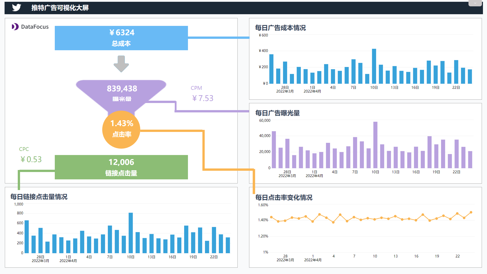

这一年，“硅谷钢铁侠”马斯克可谓是大动作不断。

先是提出收购推特100%股权，在遭到推特董事会”毒丸”计划抵制后，仍以440亿美元的价格收购了推特。此举一出，马斯克直接以有钱任性的“霸道总裁”人设火到出圈了。

最近，马斯克又以终止推特440亿美元的收购协议为条件，”胁迫”推特提供垃圾邮件和虚假账户的数据，看起来态度挺刚的。

不过事情后续很快就来了，推特还是选择了”低头”。据知情人士最新报道，推特董事会将遵守马斯克计划的要求， 提供对“Firehouse”数据库的访问权，即包含每天发布的5亿条数据流。

这让人不禁疑问，马斯克大动干戈地要这数据，到底图啥呢？

# 1.数据库访问权成了”兵符”？

其实早在当时问及马斯克收购推特的理由时，马斯克本人就有了回应，他表示对言论自由这一主题重点关注，而推特作为开放的数字广场，应当给予人们充分的言论自由。

当然这只是一部分的原因，毕竟马斯克也是个商人，既然是商人，自然要考虑更大的利益回报。

要知道现在的马斯克，是一个8000多万粉丝的超级网红，可以和泰勒·斯威夫特、贾斯汀·比伯这样的国际名流并肩。每发一次推特，就意味着有千万级的曝光，甚至还会带来特斯拉股价的上涨以及自己身价的上涨，可谓影响力巨大。

因此马斯克本人就是大IP，都不需要市场营销，发的推特就是最大的广告，发起的言论能在推特平台掀起波澜。因此牢牢握住推特这个平台，才是掌握全球首富的钥匙。

而掌握数据库访问权，就是对平台知根知底的必经之路。放开言论自由，自然也对马斯克的商业之路大有益处。

其实马斯克一直对推特对外公布的数据——虚假账户、垃圾邮件占比不到5%表示质疑。在他看来，推特真实的虚假账户、垃圾邮件数量至少是公开的4倍以上。如果虚假账户、垃圾邮件过多，可能会影响到广告的收入。查看数据库，对真实情况即可一目了然，对平台的现状也有了更进一步的了解。

# 2.马斯克大动干戈要的数据

很多平台对外公开的数据都不一定真实，但真实的数据库可以告诉你真伪。像推特的”Firehouse”，目前就有二十多家公司为访问数据库而付费，其中不仅包括推文的实时记录、发推文的设备，还有发推文账户信息。难怪推特一直有所顾忌，直到马斯克大动干戈才肯开放。

数据价值固然高，可平台数据库里每天都会更新亿级数据，数据都在指数级增长，这些都该怎么处理呢？

这时候就要通过BI工具了，将不同数据库里的数据都统一导入BI平台里的数据仓库，对数据统一治理和管理。

这里推荐一款新生代搜索式分析云BI工具DataFocus，支持多种数据库，无需SQL、Python等代码知识就可以治理数据。

像谷歌一样搜索关键词，系统就会以可视化图表回答，并且还是秒级响应。

把图表绘制在一张大屏中，即可专注于某个具体主题分析，例如对推特上投入的广告进行分析，即可像下图一样。

# **小结**

话说回来，不过也有人认为，马斯克是利用数据库访问权在给440亿美元的推特收购价格压价。甚至还有人认为，马斯克压根就不想收购推特。

不知接下来的推特又会有如何的风云变化呢？对此，你怎么看？欢迎评论区评论、分享。
